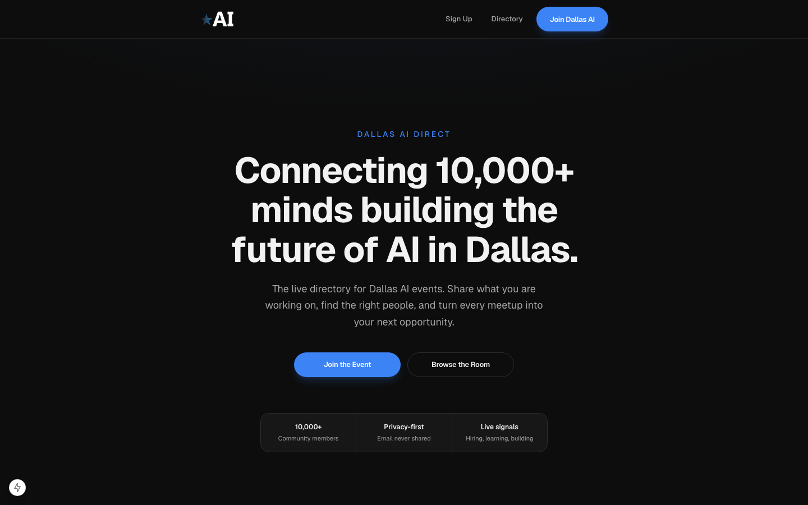
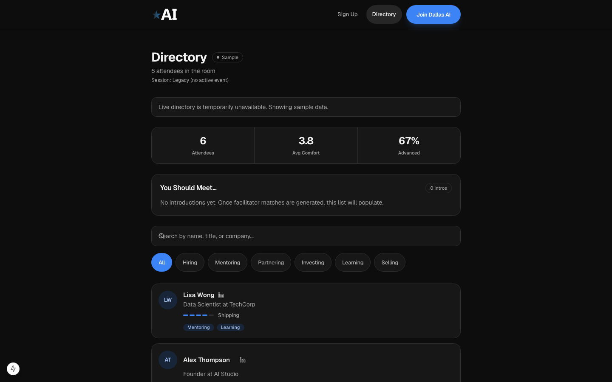
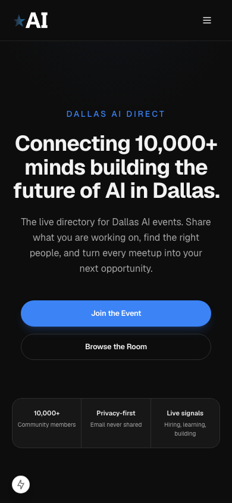
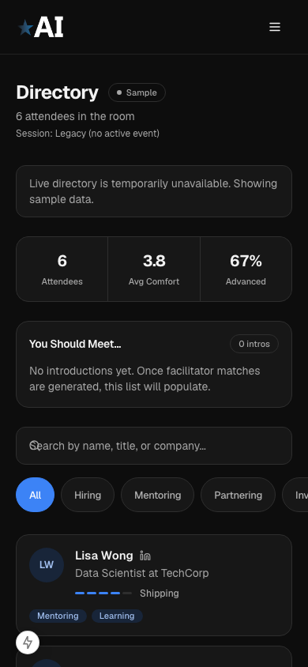
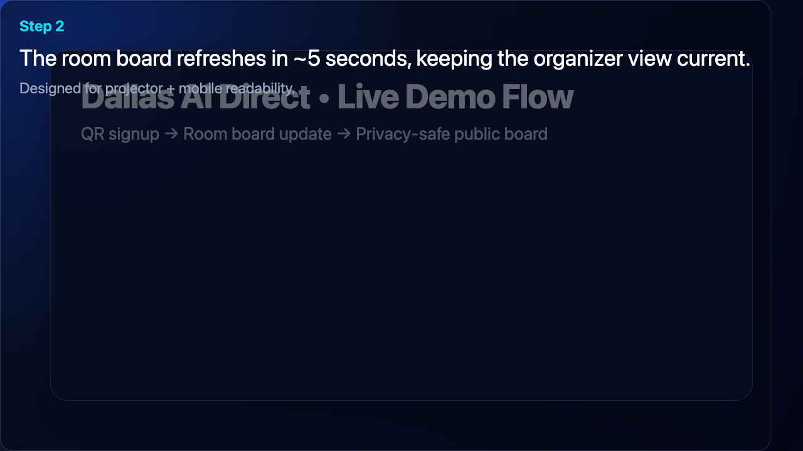

# Dallas AI Direct – Beta (Open Source)

A privacy-first, community-owned attendee directory for live events.

> Built to help operators run better rooms in real time without exposing private attendee data.

---

## Open Source Status

- License: MIT (`LICENSE`)
- Intended maintainers: Dallas AI developer community
- Governance and handoff notes: `GOVERNANCE.md`
- Contribution guide: `CONTRIBUTING.md`

## Why This Exists

Dallas AI Direct Beta is free, open-source software for event attendee visibility. It is not a paid subscription product.

Teams need real-time attendee context during events, but most tools blur the line between public display and private data handling. This repo demonstrates a safer pattern: enforce policy at the database boundary, project only public-safe fields, and keep private fields private by default.

## At a Glance

| Outcome | How this repo delivers it |
| --- | --- |
| Faster check-in flow | QR signup in about 30 seconds |
| Reliable room visibility | Board updates every ~5 seconds |
| Privacy-safe output | `attendees_public` view excludes email from public reads |
| Governed operations | RLS + constraints + deterministic validation gates |
| Operator confidence | Reproducible `typecheck`, `test`, and `build` checks |

## Live Product Screenshots

Current `main` build captures for repo readers who want visual context before running locally.

### Desktop

| Landing | Signup |
| --- | --- |
|  |  |

| Room Directory | Admin Login |
| --- | --- |
|  |  |

### Mobile

| Landing | Room Directory |
| --- | --- |
|  |  |

## Hero Moment

Attendees scan a QR code, submit in about 30 seconds, and appear on the room board within 5 seconds. The board reads only public-safe fields. Email never appears on public surfaces. Database boundary controls enforce the policy even if UI behavior changes.

## README Demo (Remotion)

A lightweight Remotion demo visualizes the Dallas AI Direct flow:
1. QR signup
2. Room board update
3. Privacy-safe public view (no email exposure)

[](public/demo/dallas-ai-direct-remotion-demo.mp4)

Caption: Dallas AI Direct flow — QR signup → room board update → privacy-safe public view (attendee email is never shown publicly).

To regenerate assets from repo root:

```bash
npm run demo:remotion:generate
# or run render/still/check separately
npm run demo:remotion:render
npm run demo:remotion:still
npm run demo:remotion:check
```

---

## Architecture Snapshot

```text
Client (QR + Browser)
        |
        v
API Route (Validated Insert)
        |
        v
Neon Postgres
        |
        v
RLS (Deny by Default)
        |
        v
attendees_public View
        |
        v
Room Board (Polling every 5s)
```

### Why this architecture

- Enforces access where data lives, not where rendering happens.
- Uses projection boundary (`attendees_public`) to prevent email leakage.
- Separates base table writes from public reads.
- Uses polling over realtime for demo reliability and lower operational variance.

## Data Model and Consent Design

### Core fields

- Required: `name`, `email`, `ai_comfort_level`, `help_needed`, `help_offered`
- Optional: `linkedin_url`, `title`, `company`, `other_help_needed`, `other_help_offered`
- Consent flag: `display_title_company` (default `false`)

### Data principles

- Least privilege: public UI reads from projection only.
- Projection boundary: `attendees_public` excludes sensitive/private fields.
- Explicit consent: `title` and `company` display requires opt-in.
- Sensitive-by-default: email remains private across public flows.

## Security Posture

### Database controls

- RLS enabled and forced on sensitive table.
- Deny-by-default select posture on base table.
- Unique index on normalized email.
- Check constraints for ranges and field limits.
- Public projection view excludes email.

### Application controls

- Honeypot field for low-effort bot filtering.
- Server-side validation for payload shape and bounds.
- Optional throttling strategy for burst abuse.
- Escaped rendering to reduce injection risk.

### STRIDE summary

| Threat | Primary mitigation | Residual risk |
| --- | --- | --- |
| Spoofing | Honeypot + validation | Moderate in anonymous alpha |
| Tampering | Server validation + DB constraints | Low to moderate |
| Repudiation | Event logs + timestamps | Moderate |
| Information disclosure | RLS + `attendees_public` boundary | Low if controls stay enforced |
| Denial of service | Throttling + fallback mode | Moderate under hostile traffic |
| Elevation of privilege | No public base-table reads | Low to moderate |

## Quickstart (10 minutes)

### Prerequisites

- Node 20+
- A Neon Postgres database

### 1) Install and configure

```bash
npm ci
cp .env.example .env.local # or create .env.local manually
```

Set:

```bash
DATABASE_URL=postgres://...
SESSION_SECRET=...
ADMIN_EMAIL=...
ADMIN_PASSWORD=...
NEXT_PUBLIC_ATTENDEE_AUTH_REQUIRED=false # set true for public beta auth gating
# if enabled:
# NEXT_PUBLIC_CLERK_PUBLISHABLE_KEY=...
# CLERK_SECRET_KEY=...
```

### 2) Run bootstrap readiness

```bash
npm run bootstrap:beta
```

### 3) Apply database schema + policies

Follow:
- `docs/data-model.md`
- `docs/rls-policies.md`

### 4) Start locally

```bash
npm run dev
```

Open:
- `http://localhost:3000/signup`
- `http://localhost:3000/room`
- `http://localhost:3000/sign-in` (when attendee auth is enabled)

## Auth Posture Defaults

- Recommended handoff mode: gated attendee auth (`NEXT_PUBLIC_ATTENDEE_AUTH_REQUIRED=true`) for public beta.
- If attendee auth is required but Clerk keys are missing, attendee auth endpoints fail closed with explicit setup errors.
- `/admin` is an authenticated operational surface for facilitator decisions and audit-linked actions.

## Runtime Validation Discipline

Pre-demo runtime validation is a release gate.

- Preflight SQL checks for table/view access behavior
- Email non-exposure verification in payload and UI
- Duplicate insert rejection check
- Comfort-level bounds check
- XSS rendering sanity check
- Mobile QR sanity checklist for iPhone Safari and Android Chrome

Go/No-Go requires all privacy and boundary checks to pass.

Run before release:

```bash
npm run typecheck
npm test
npm run build
```

Primary references:
- `docs/runtime-validation.md`
- `ops/preflight.md`
- `docs/traceability-matrix.md`
- `docs/handoff/README.md`
- `tests/ui-mobile-audit.md`

If documentation conflicts, prioritize:
1. `docs/rls-policies.md`
2. `docs/runtime-validation.md`
3. `docs/PRD.md`

## Why this is more than a directory

This implementation acts as a projection-bound identity and capability mapping layer. It demonstrates a reusable pattern for governed AI-enabled workflows inside organizations.

## AI Infrastructure Sprint Model

1. Constraint mapping
2. Architecture and governance design
3. Working alpha delivery
4. ROI framing and roadmap handoff

This sprint produces a working artifact, not a slide deck.

## Design Principles

- Enforce access at the database boundary.
- Never expose sensitive fields on public surfaces.
- Prefer reliability over flash.
- Build the smallest system that proves constraint removal.
- Make consent explicit and default-safe.
- Keep operational knobs separate from reference artifacts.

## Deliberate Non-Goals

- No OAuth/SSO flows in alpha.
- No realtime subscription dependency for demo path.
- No marketing or compliance claims.
- No schema overreach beyond current constraint.
- No dependency expansion outside core stack.

## Repository Navigation

- `docs/` architecture, security, policy, runbooks, and open TODOs (`docs/OPEN-TODO.md`)
- `tests/` validation plans and smoke checks
- `ops/` operational checklists and incident guidance
- `prompts/` implementation notes for maintainers (product-focused only)

## Design System References

For demo-facing UI, use the minimal design system package:
- `docs/brand-guidelines.md`
- `docs/ui-patterns.md`
- `docs/assets.md`

Brand implementation rule:
- Dallas AI logo assets in `public/brand/` are required on shared demo shell and hero-facing surfaces.

---

## Closing

This repository demonstrates how to replace vague AI readiness discussions with a governed, working system in hours.

We build this pattern inside organizations around revenue constraints.
